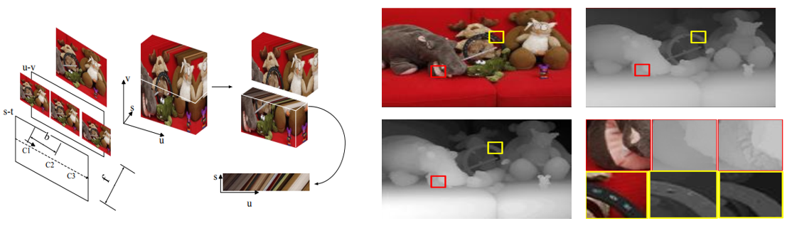

Code for A Semi-Global Matching method for large-scale light field images (https://ieeexplore.ieee.org/abstract/document/7471956/) and Using plane+ parallax for calibrating dense camera arrays
=============

## Acknowledgments

Link to Dataset : https://people.csail.mit.edu/changil/light-field-depth/

Link to Dataset : http://lightfield.stanford.edu/lfs.html
